# Log Analysis

## Overview

Logs are the primary evidence trail in IT security. Knowing where to look, what to filter for, and what each event means is a core skill for helpdesk, sysadmin, and SOC roles. This phase covers log analysis on both Windows (Event Viewer) and Linux (auth.log + journald).

---

## Part 1 — Windows Event Viewer

### Opening Event Viewer

Search "Event Viewer" in the Start menu, or run `eventvwr.msc`.

Navigate to: **Windows Logs → Security**

The Security log records all auditable events — logons, account changes, policy changes, and more. The volume can be high (thousands of events), so filtering by Event ID is essential.

### How to Filter by Event ID

In the Actions panel on the right → **Filter Current Log** → enter the Event ID in the field → click OK.

---

### Event ID 4624 — Successful Logon

**What it means:** An account successfully authenticated and a session was established.

**Filter:**

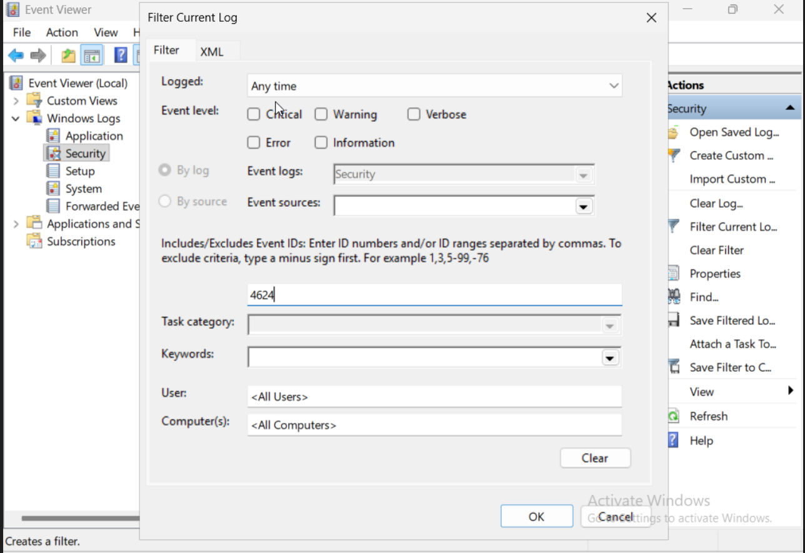

**Filtered results and event detail:**

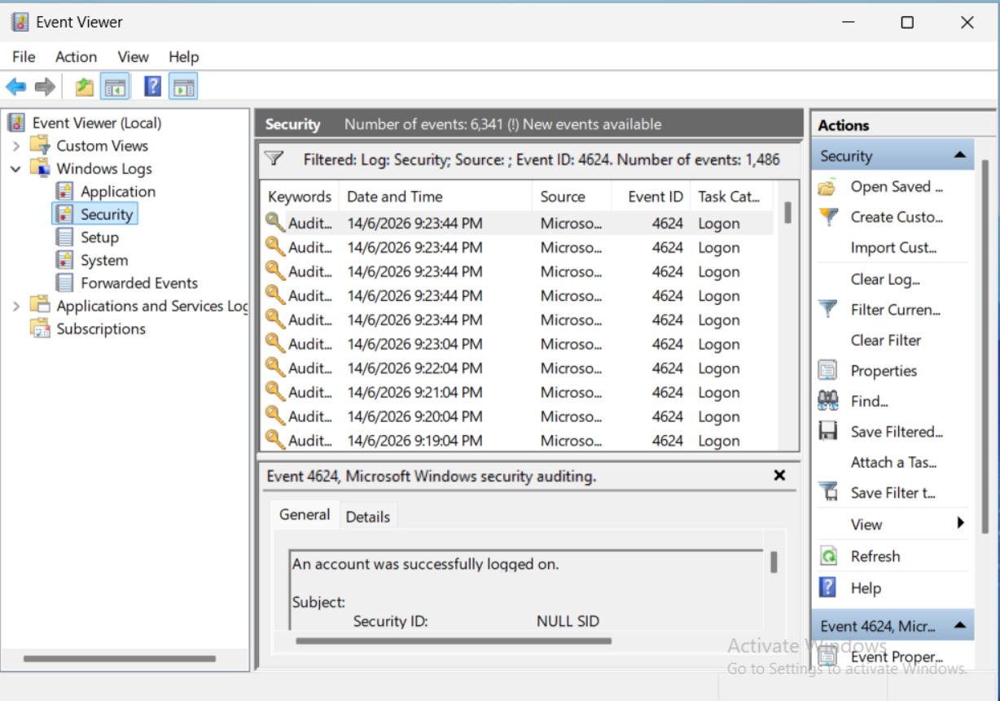

**Individual event properties:**

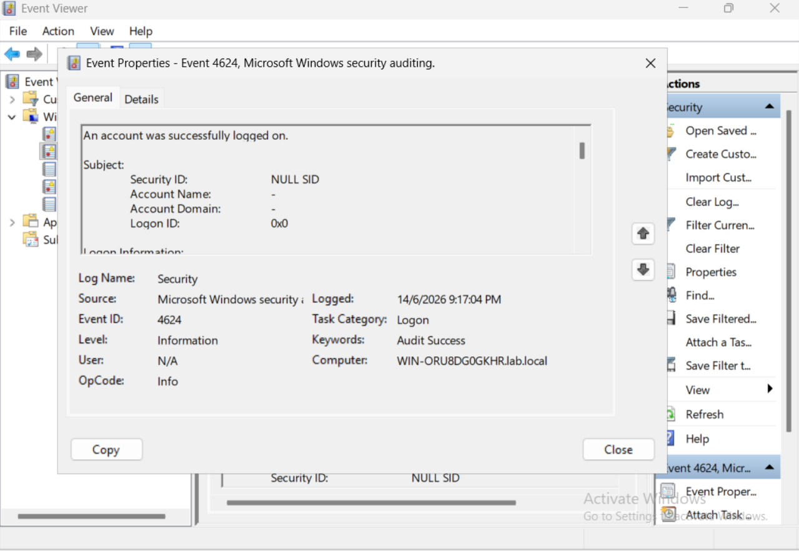

**Key fields to check:**
- **Account Name** — which account logged on
- **Logon Type** — 2 = interactive (local), 3 = network, 10 = remote interactive (RDP)
- **Computer** — which machine the logon occurred on
- **Logged** — timestamp of the event

**When to investigate:** After-hours logons, logons from unexpected accounts (e.g. `Guest`, `krbtgt`), or a surge of 4624 events immediately following repeated 4625 failures (potential successful brute-force).

---

### Event ID 4625 — Failed Logon

**What it means:** An account attempted to authenticate but failed.

**Filter:**

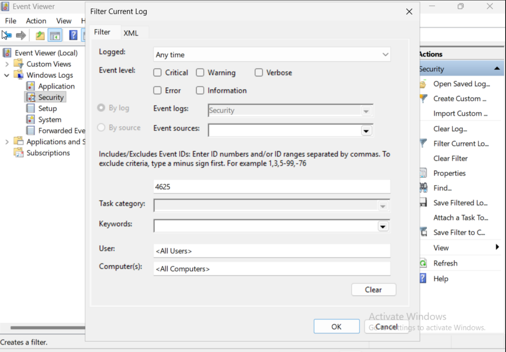

**Filtered results:**

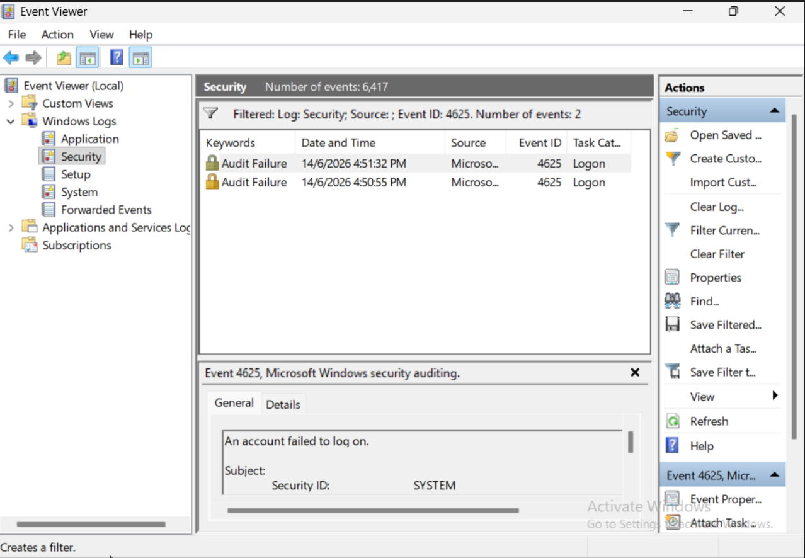

**Individual event properties:**

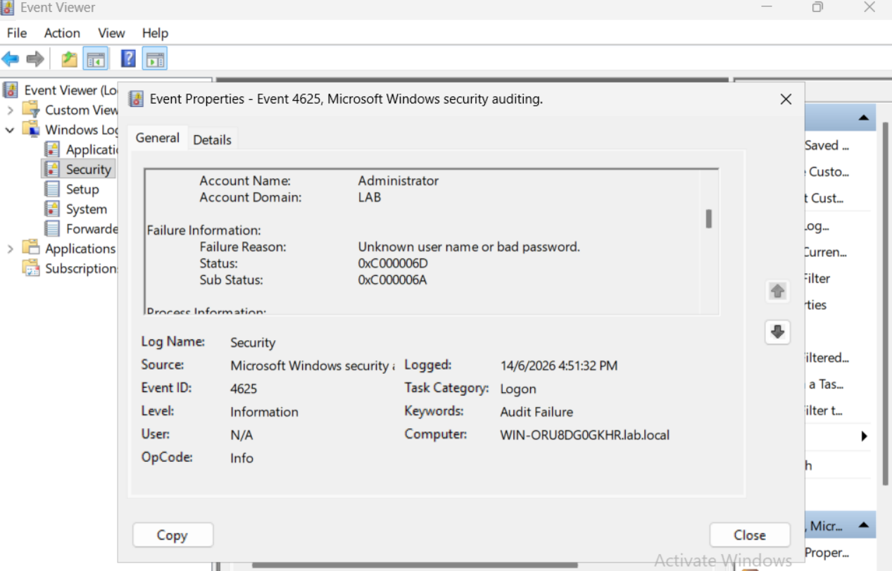

In the lab, the failure reason shown is **Unknown user name or bad password** with status `0xC000006D` and sub-status `0xC000006A` (correct username, wrong password).

**Common sub-status codes:**

| Sub-status | Meaning |
|---|---|
| 0xC000006A | Correct username, wrong password |
| 0xC0000064 | Username does not exist |
| 0xC0000234 | Account is locked out |
| 0xC0000072 | Account is disabled |

**When to investigate:** Multiple 4625 events for the same account in a short window is a strong indicator of a brute-force or credential stuffing attack. Correlate with 4740 (lockout) and 4624 (did it eventually succeed?).

---

### Event ID 4720 — User Account Created

**What it means:** A new user account was created in Active Directory.

**Filter:**

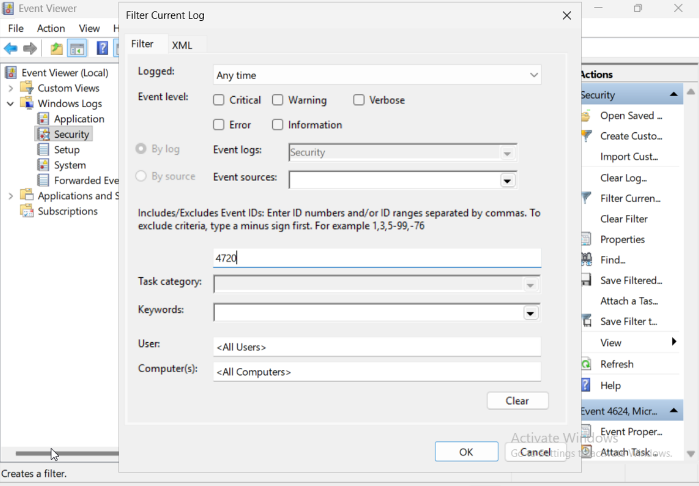

**Filtered results:**

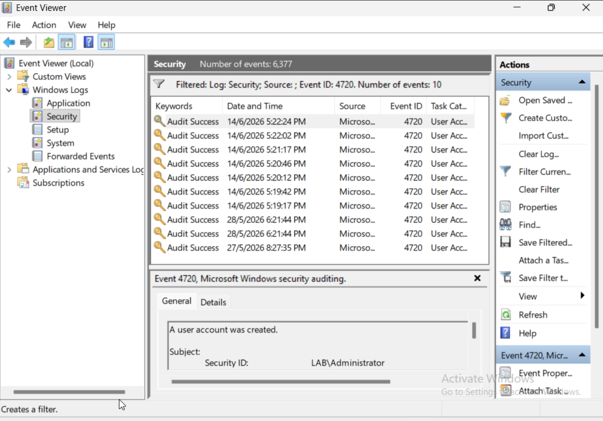

**Individual event properties:**

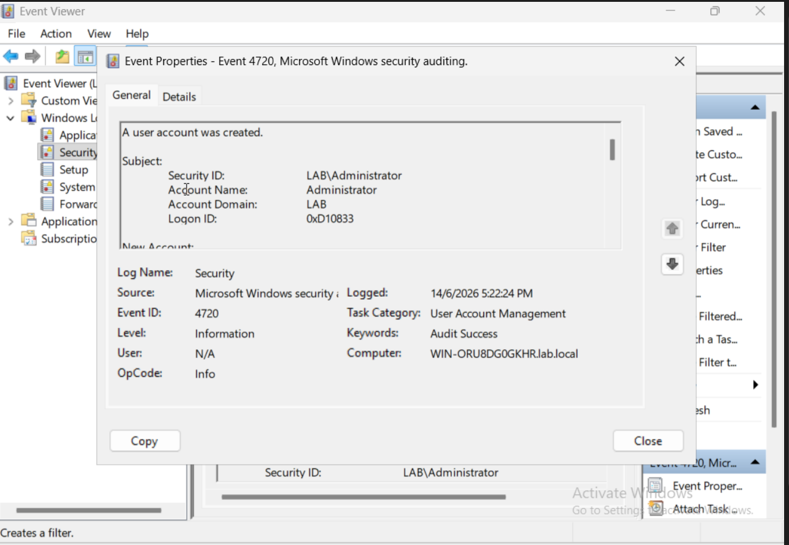

The event records which administrator account created the new user (`LAB\Administrator` in this lab) and the timestamp. In a real environment, every 4720 event should correspond to an approved IT ticket or onboarding request.

**When to investigate:** Any 4720 event that doesn't match a known provisioning request is a red flag — it could indicate an attacker creating a backdoor account for persistence.

---

### Event ID Reference Summary

| Event ID | Event | Category | What to look for |
|---|---|---|---|
| 4624 | Successful logon | Logon | After-hours, unusual accounts, post-failure success |
| 4625 | Failed logon | Logon | Repeated failures = brute-force attempt |
| 4720 | User account created | User Account Management | Unplanned account creation = possible backdoor |
| 4740 | Account locked out | User Account Management | Repeated lockouts = active attack or misconfiguration |
| 4648 | Logon with explicit credentials | Logon | Credential reuse, pass-the-hash indicators |
| 4672 | Special privileges assigned | Privilege Use | Admin-level access granted at logon |

---

## Part 2 — Linux Log Analysis

### The Two Approaches

Ubuntu 26.04 uses `systemd-journald` as its primary logging backend. The traditional `/var/log/auth.log` file may or may not exist depending on whether `rsyslog` is installed. Both methods are covered here.

---

### Traditional — `/var/log/auth.log`

`auth.log` captures authentication events including SSH logins, sudo usage, PAM events, and su switches.

```bash
# View the last 50 lines
sudo tail -50 /var/log/auth.log

# Search for failed password attempts
sudo grep "Failed password" /var/log/auth.log
```

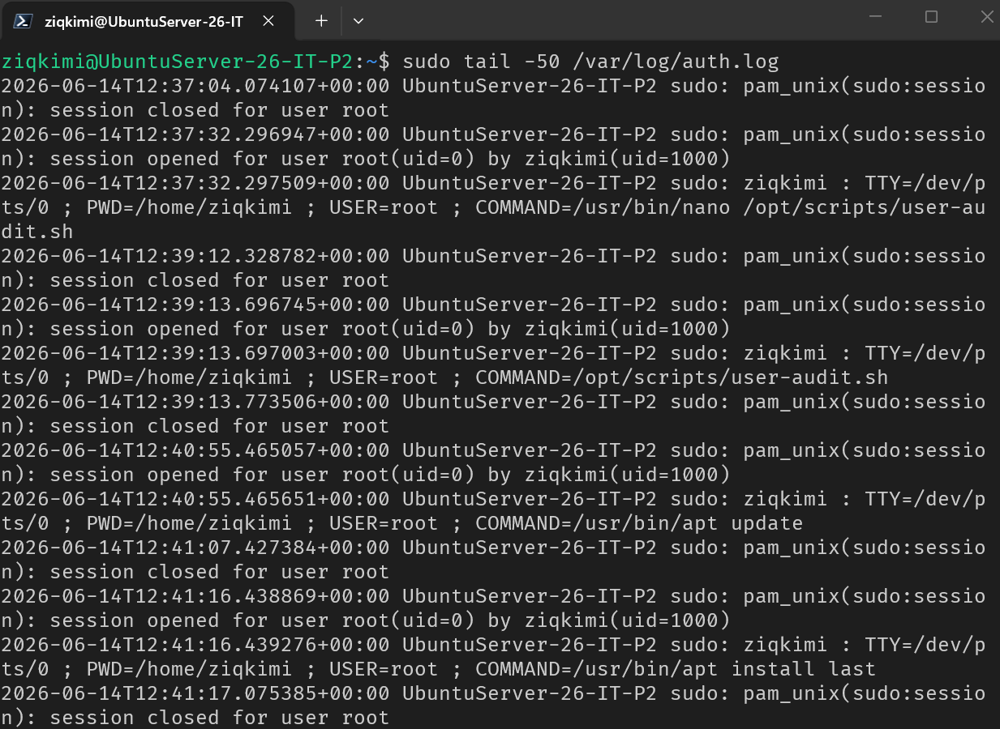

The log output shows `sudo` session events — each command run with elevated privileges is recorded, including the full command, the user who ran it, and the timestamp. This is exactly what you'd review during an incident to reconstruct what an account did.

**Searching for failed logins:**

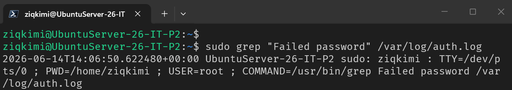

> **Ubuntu 26.04 note:** On a minimal Ubuntu 26.04 install, `auth.log` exists but may only capture `sudo` PAM events rather than SSH failures. If SSH login failures are missing from `auth.log`, use `journalctl` instead (see below).

---

### Modern — `journalctl`

`journalctl` queries the systemd journal directly and is always available regardless of whether `rsyslog` is installed.

```bash
# All SSH service logs
sudo journalctl _SYSTEMD_UNIT=sshd.service

# Search for failed password across all logs
sudo journalctl | grep "Failed password"

# Filter by priority (errors and above) in the last hour
sudo journalctl -p err --since "1 hour ago"

# Follow live (like tail -f for real-time monitoring)
sudo journalctl -f
```

**Failed login via journalctl:**

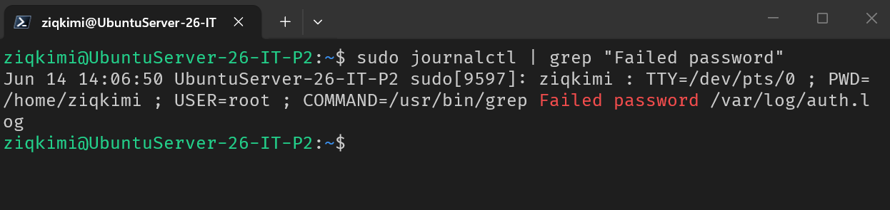

---

### Linux vs Windows Log Comparison

| Concept | Windows | Linux |
|---|---|---|
| Primary log tool | Event Viewer | journalctl |
| Auth events file | Security event log | /var/log/auth.log or journald |
| Failed login event | Event ID 4625 | "Failed password" in sshd logs |
| Successful login event | Event ID 4624 | "Accepted password" or PAM session opened |
| Account created | Event ID 4720 | useradd logged to auth.log |
| Privilege escalation | Event ID 4672 | sudo session opened in auth.log |
| Log query tool | Filter Current Log (GUI) or `Get-WinEvent` (PowerShell) | `grep`, `journalctl`, `awk` |

---

## Why Log Analysis Matters

Logs are the first place you go during an incident. Whether you're investigating a locked account, a suspicious after-hours login, or an unauthorised configuration change — the answer is in the logs. Being comfortable reading both Windows Event Logs and Linux system logs, and knowing which Event IDs and keywords to search for, is a skill that directly translates to helpdesk escalations, sysadmin investigations, and SOC triage work.