# Group Policy Configuration

## Overview

Group Policy is the mechanism Windows uses to enforce settings across users and computers in an Active Directory domain. A Group Policy Object (GPO) is a collection of rules that gets linked to a domain, site, or Organizational Unit (OU) and applied automatically at startup or login.

In this lab, two GPOs are configured:

| GPO Name | Linked To | Purpose |
|---|---|---|
| Security-Baseline | `lab.local` (domain-wide) | Password, lockout, and audit policies for all users |
| IT-Restrictions | IT Department OU | Demonstrates OU-scoped policy targeting |

---

## Opening Group Policy Management

Server Manager → **Tools** → **Group Policy Management**

To create a GPO: right-click the domain or OU → **Create a GPO and Link it here** → name it → right-click → **Edit** to open the Group Policy Management Editor.

---

## GPO 1 — Security-Baseline

### Navigation Path

`Computer Configuration → Policies → Windows Settings → Security Settings → Account Policies`

---

### Account Policies (overview)

Under **Account Policies**, there are three sub-sections:

- **Password Policy** — controls password strength and expiry
- **Account Lockout Policy** — controls what happens after repeated failed logins
- **Kerberos Policy** — controls ticket lifetimes for domain authentication (left at defaults in this lab)

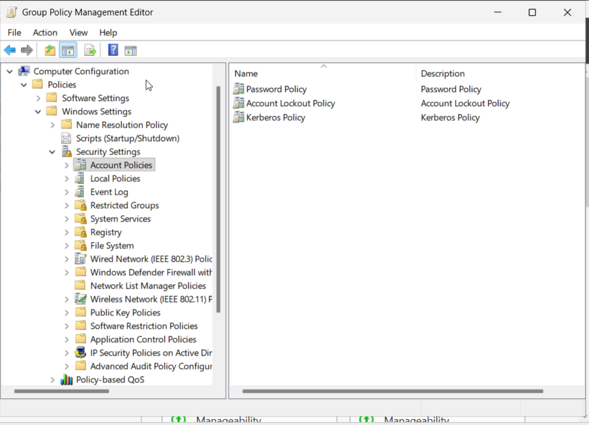

---

### Password Policy

`Account Policies → Password Policy`

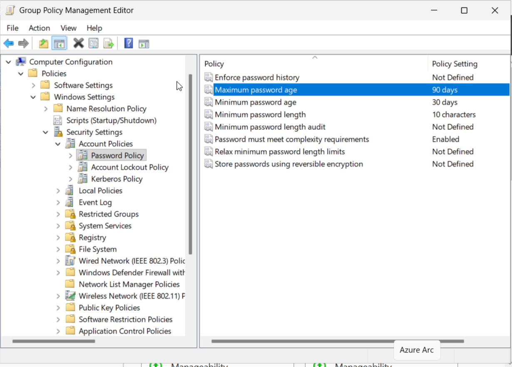

**Settings configured:**

| Policy | Value | Why it matters |
|---|---|---|
| Minimum password length | 10 characters | Short passwords are trivially brute-forced; 10+ characters significantly increases attack cost |
| Maximum password age | 90 days | Limits the window of exposure if a password is compromised without the user knowing |
| Password must meet complexity requirements | Enabled | Forces a mix of uppercase, lowercase, numbers, and symbols |

**Minimum password length — Properties:**

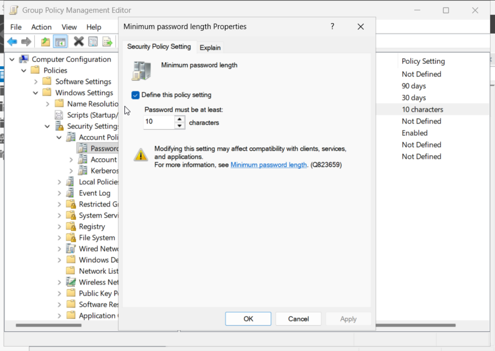

**Maximum password age — Properties:**

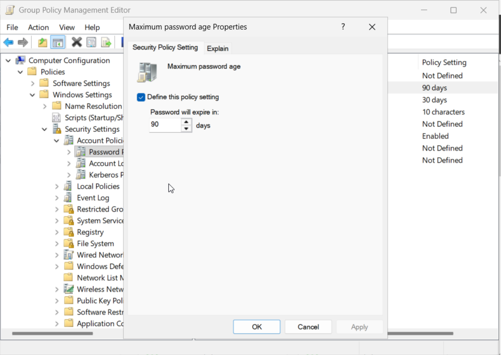

**Complexity requirements — Properties:**

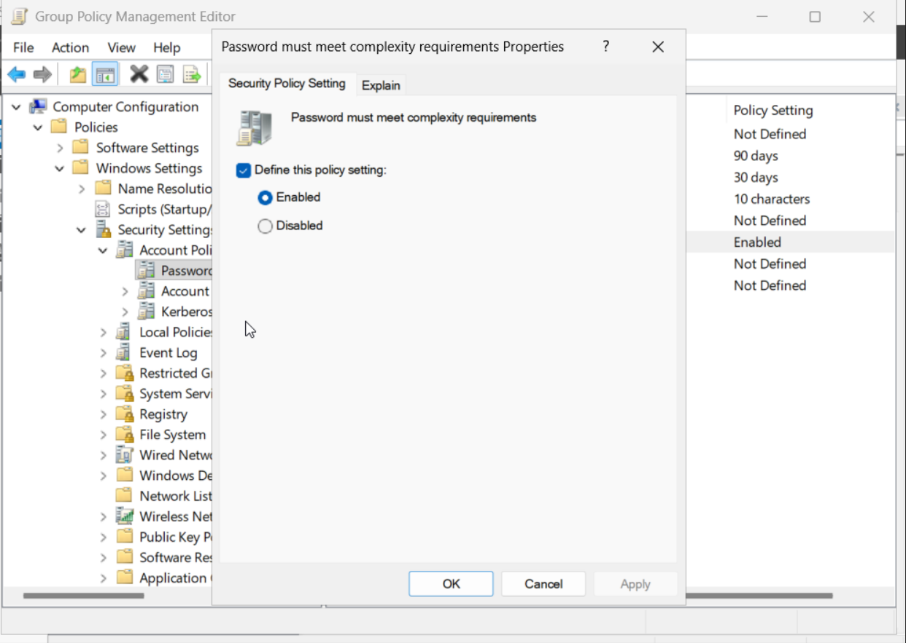

---

### Account Lockout Policy

`Account Policies → Account Lockout Policy`

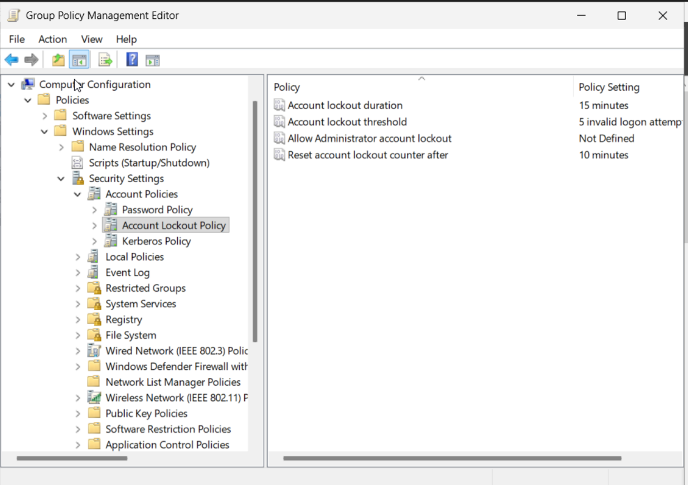

**Settings configured:**

| Policy | Value | Why it matters |
|---|---|---|
| Account lockout threshold | 5 invalid logon attempts | Stops brute-force attacks by locking the account after repeated failures |
| Account lockout duration | 15 minutes | Auto-unlocks after 15 minutes, reducing helpdesk calls while still deterring attacks |
| Reset account lockout counter after | 10 minutes | Clears the failed-attempt count after 10 minutes of no failures |

**Lockout threshold — Properties:**

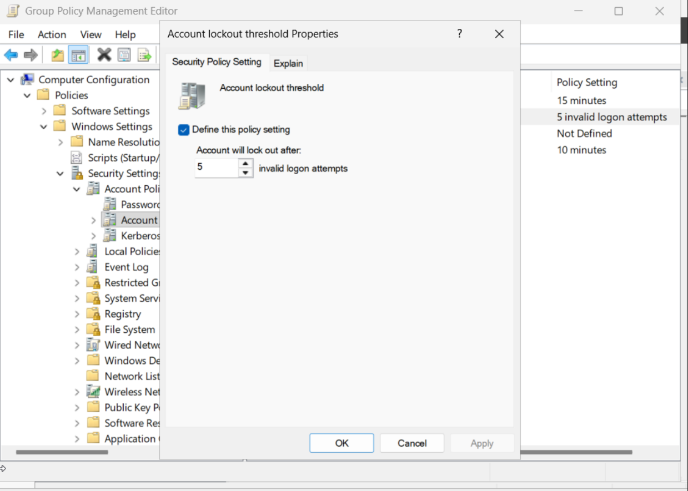

**Lockout duration — Properties:**

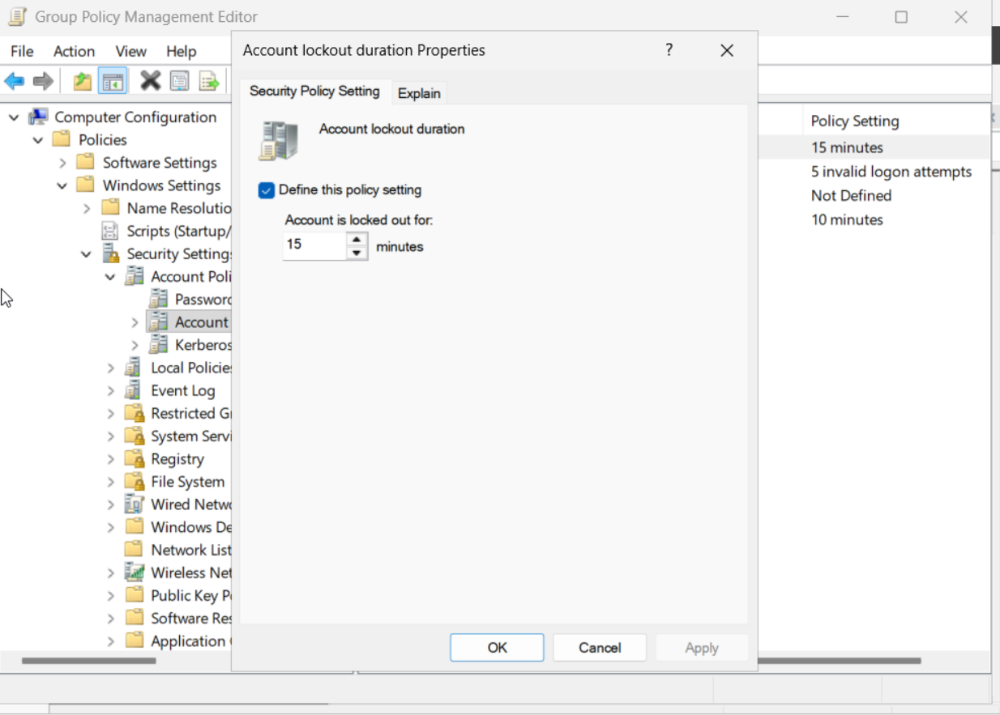

---

### Kerberos Policy

`Account Policies → Kerberos Policy`

Left at **Not Defined** (domain defaults apply). Shown here for completeness — Kerberos is the authentication protocol used by Active Directory for issuing and validating session tickets.

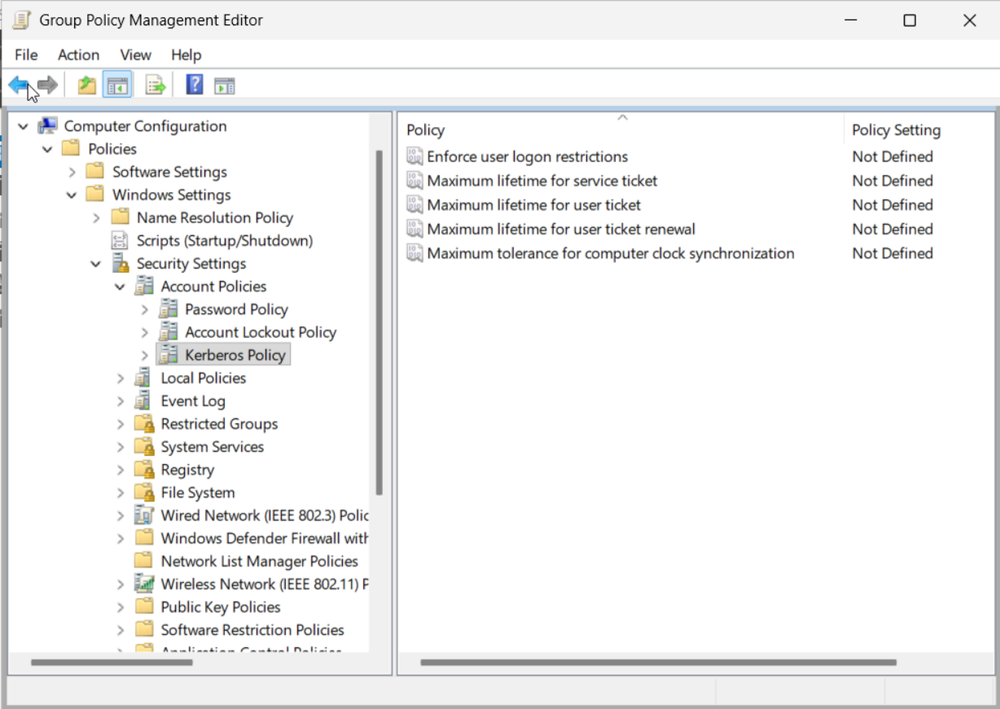

---

### Audit Policy

`Local Policies → Audit Policy`

Audit policies tell Windows which security events to write to the Event Log. Without auditing enabled, there is no record of logon activity to investigate during an incident.

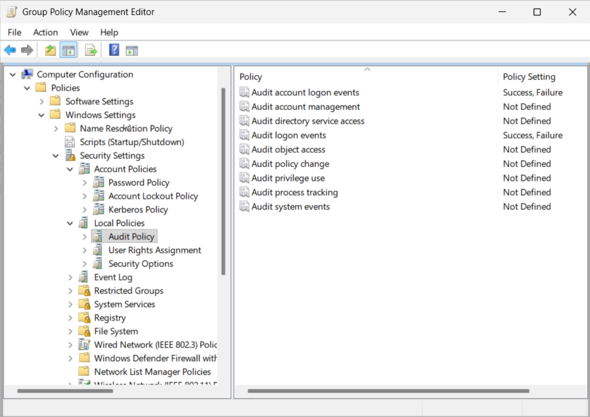

**Settings configured:**

| Policy | Value |
|---|---|
| Audit account logon events | Success, Failure |
| Audit logon events | Success, Failure |

**Audit account logon events — Properties:**

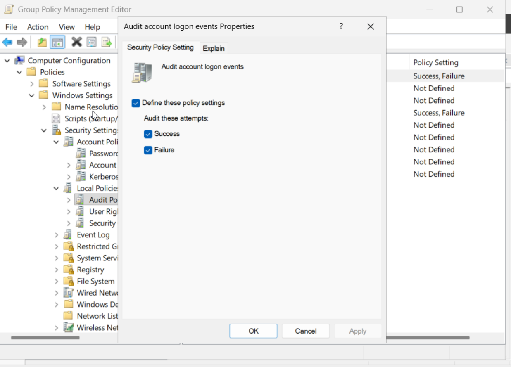

**Audit logon events — Properties:**

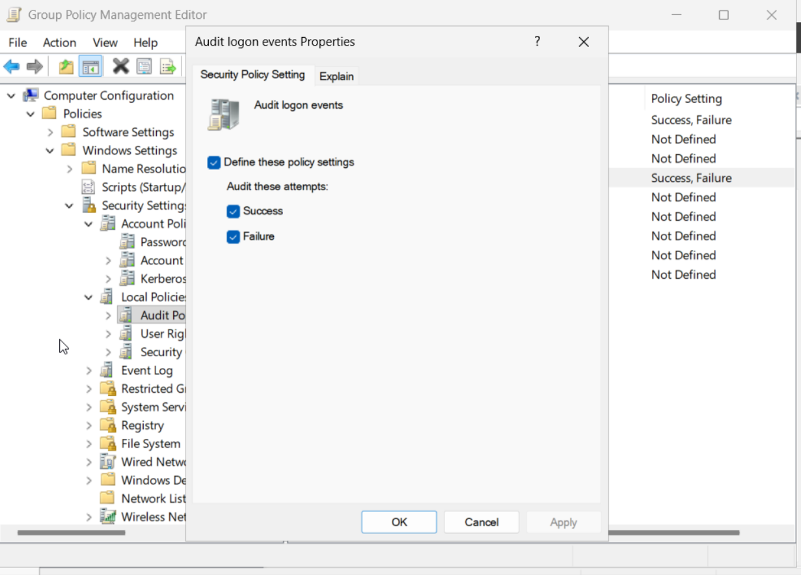

> **Difference between the two:** "Audit logon events" records interactive logons at the machine being logged into. "Audit account logon events" records the authentication request at the domain controller. In a domain environment, both should be enabled.

---

## GPO 2 — IT-Restrictions

This GPO is linked to the **IT Department OU only**, demonstrating that Group Policy can be scoped to a specific part of the directory rather than the whole domain.

### Navigation Path

`User Configuration → Policies → Administrative Templates → System`

### Setting Configured

**Prevent access to the command prompt** — Enabled

The setting is found under the System folder in Administrative Templates. The right panel shows the full list of System policies with "Prevent access to the command prompt" highlighted:

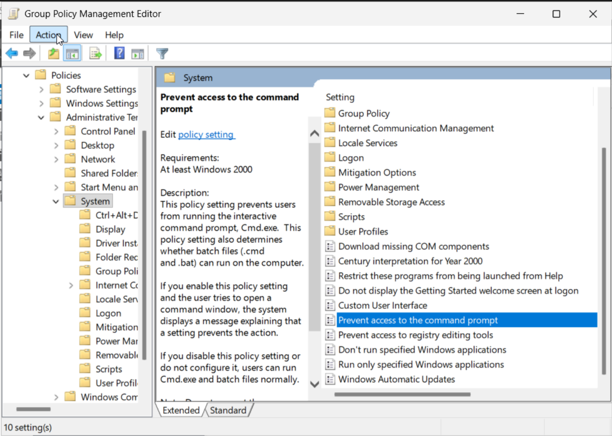

Double-clicking it opens the properties dialog where it is set to Enabled, with script processing also disabled:

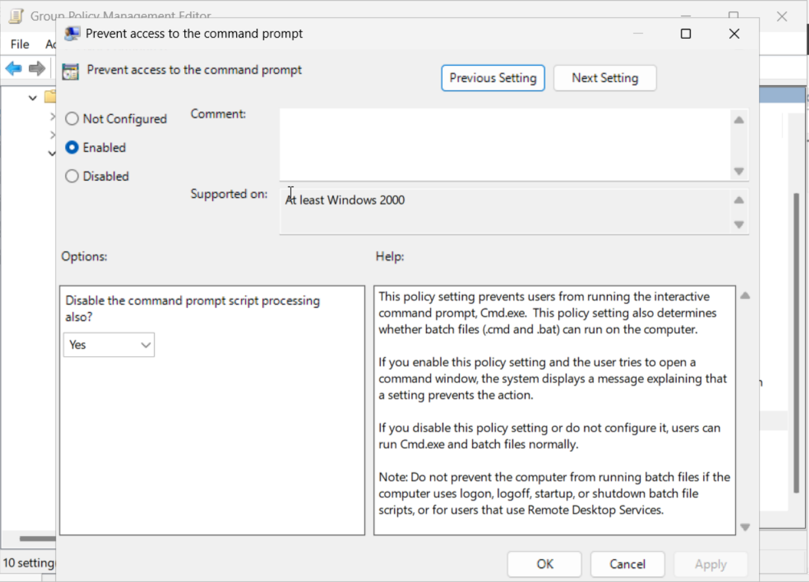

The "Disable the command prompt script processing also?" option is set to **Yes**, which prevents `.cmd` and `.bat` batch files from running as well — not just the interactive `cmd.exe` window.

> **Real-world note:** This restriction makes sense for standard end-users (Finance, HR) or locked-down kiosk machines where users should not have access to system tools. Applying it to IT staff in production would break their ability to do their job. It is used here purely to demonstrate OU-level GPO scoping.

---

## How GPO Processing Works

1. Computer starts → computer-scoped GPOs apply
2. User logs in → user-scoped GPOs apply
3. GPOs are applied in order: Local → Site → Domain → OU (child OUs last)
4. Later GPOs override earlier ones where settings conflict (unless "No Override" / "Enforced" is set)

To force an immediate GPO refresh without waiting for the next login cycle:
```cmd
gpupdate /force
```
