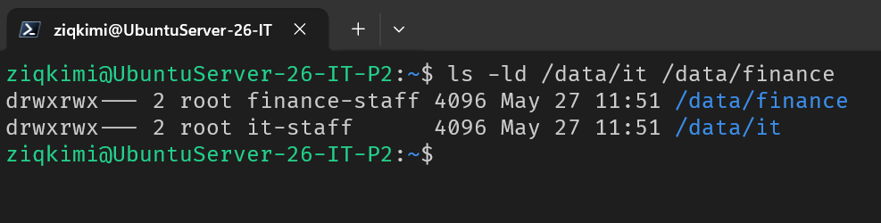
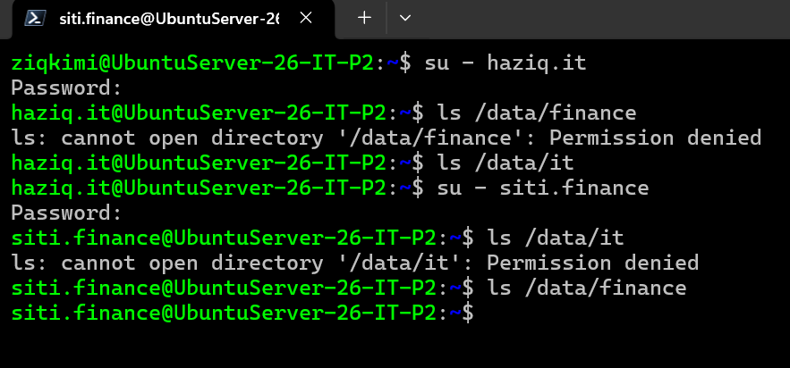

# Linux User Management & Permissions

## Overview

Linux manages access control through users, groups, and file permissions. This phase mirrors the departmental structure from Active Directory — creating equivalent users and groups on Ubuntu Server 26.04, then locking down shared directories so each department can only access their own data.

---

## Step 1 — Create Groups

```bash
sudo groupadd it-staff
sudo groupadd finance-staff
```

Groups in Linux serve the same conceptual role as security groups in Active Directory. Permissions are assigned to the group, and users inherit access by membership.

---

## Step 2 — Create Users and Assign Groups

```bash
# IT Department
sudo useradd -m -s /bin/bash haziq.it
sudo usermod -aG it-staff haziq.it
sudo passwd haziq.it

# Finance Department
sudo useradd -m -s /bin/bash siti.finance
sudo usermod -aG finance-staff siti.finance
sudo passwd siti.finance
```

**Flag breakdown:**

| Flag | Meaning |
|---|---|
| `-m` | Creates a home directory at `/home/<username>` |
| `-s /bin/bash` | Sets the default shell to Bash |
| `-aG` | Appends the user to a supplementary group without removing existing group memberships |

---

## Step 3 — Create Department Directories

```bash
sudo mkdir -p /data/it /data/finance
```

---

## Step 4 — Set Ownership and Permissions

```bash
# IT directory — owned by root, group it-staff
sudo chown root:it-staff /data/it
sudo chmod 770 /data/it

# Finance directory — owned by root, group finance-staff
sudo chown root:finance-staff /data/finance
sudo chmod 770 /data/finance
```

**Verify the result:**

```bash
ls -ld /data/it /data/finance
```



Output shows `drwxrwx---` for both directories — confirming owner and group have full access, and all others are denied.

---

## Understanding `chmod 770`

Linux permissions are represented as three sets of three bits: **owner**, **group**, **others**.

| Who | Permissions | Numeric value |
|---|---|---|
| Owner (root) | rwx — read, write, execute | 7 |
| Group members | rwx — read, write, execute | 7 |
| Others | --- — no access | 0 |

**`chmod 770` vs `chmod 777`:**

`chmod 777` grants full access to every user on the system — including unauthenticated or low-privilege accounts. This is almost never appropriate in production and is a common misconfiguration that creates security vulnerabilities.

`chmod 770` restricts access to the owning group only, which is the correct model for department-level shared directories.

---

## Step 5 — Test Cross-Department Access Denial

Switch to `haziq.it` and attempt to access the Finance directory:

```bash
su - haziq.it
ls /data/finance
# Expected: Permission denied

ls /data/it
# Expected: Success (empty listing)
```

Then switch to `siti.finance` and attempt to access the IT directory:

```bash
su - siti.finance
ls /data/it
# Expected: Permission denied

ls /data/finance
# Expected: Success (empty listing)
```



Both cross-department attempts are denied. This confirms the permission model is working correctly — each user can only access their own department's directory.

---

## How This Maps to Active Directory

| Linux concept | Windows / AD equivalent |
|---|---|
| `groupadd` | New → Group in AD |
| `useradd` | New → User in AD |
| `usermod -aG` | Adding a user to a group's Members tab |
| `chown root:it-staff /data/it` | Setting group ownership on a shared folder |
| `chmod 770` | Granting group Read/Write/Execute, denying others |
| `/etc/passwd` | User account database (like AD user objects) |
| `/etc/group` | Group membership database (like AD group membership) |

Understanding both sides of this — Windows and Linux — is a core competency for helpdesk and junior sysadmin roles that operate in mixed environments.
