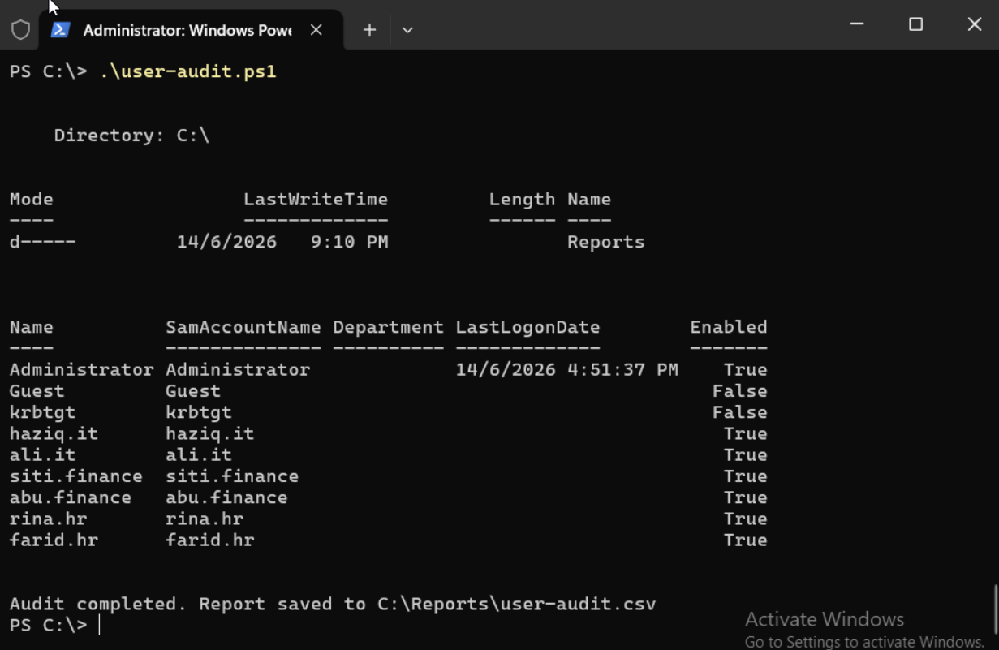

# Shell Scripting & Automation

## Overview

Manual checks don't scale. This phase covers automating the most common sysadmin task — auditing who has access to what — on both Linux (Bash) and Windows (PowerShell). A cron job handles scheduling on Linux so the audit runs automatically every day without human intervention.

---

## Part 1 — Bash User Audit Script (Linux)

### Create the script

```bash
sudo mkdir -p /opt/scripts
sudo nano /opt/scripts/user-audit.sh
```

### Script contents

```bash
#!/bin/bash
echo "=== User Audit Report ==="
echo "Date: $(date)"
echo ""
echo "--- Active users ---"
cut -d: -f1,3,6 /etc/passwd | awk -F: '$2 >= 1000'
echo ""
echo "--- Groups ---"
cat /etc/group | grep -E "it-staff|finance-staff"
echo ""
echo "--- Last logins ---"
last | head -20
```

**What each section does:**

| Section | Command | Purpose |
|---|---|---|
| Active users | `cut -d: -f1,3,6 /etc/passwd` | Extracts username, UID, and home directory from the passwd file |
| UID filter | `awk -F: '$2 >= 1000'` | Filters to real user accounts only (UID ≥ 1000 = non-system users on Ubuntu) |
| Groups | `grep -E "it-staff\|finance-staff"` | Shows membership of the two department groups |
| Last logins | `last \| head -20` | Shows the 20 most recent login sessions |

### Make it executable and test

```bash
sudo chmod +x /opt/scripts/user-audit.sh
sudo /opt/scripts/user-audit.sh
```

---

## Part 2 — Schedule with Cron

Cron is Linux's built-in task scheduler. It runs commands on a fixed schedule defined in a crontab file.

```bash
sudo crontab -e
```

Add this line at the bottom:

```
0 8 * * * /opt/scripts/user-audit.sh >> /var/log/user-audit.log 2>&1
```

**Cron syntax breakdown:**

```
0    8    *    *    *    /opt/scripts/user-audit.sh
│    │    │    │    │
│    │    │    │    └── Day of week (0-7, 0=Sunday)
│    │    │    └─────── Month (1-12)
│    │    └──────────── Day of month (1-31)
│    └───────────────── Hour (0-23)
└────────────────────── Minute (0-59)
```

This runs the audit every day at 08:00 and appends output to `/var/log/user-audit.log`. The `2>&1` redirects any errors to the same log file.

**Verify the crontab was saved:**

```bash
sudo crontab -l
```

---

## Part 3 — PowerShell AD Audit Script (Windows)

### Create the Reports directory

```powershell
New-Item -ItemType Directory -Path "C:\Reports" -Force
```

### Script contents

Save as `C:\user-audit.ps1`:

```powershell
# AD User Audit Script
Import-Module ActiveDirectory

$report = Get-ADUser -Filter * -Properties LastLogonDate, Department |
    Select-Object Name, SamAccountName, Department, LastLogonDate, Enabled

$report | Format-Table -AutoSize
$report | Export-Csv "C:\Reports\user-audit.csv" -NoTypeInformation

Write-Host "Audit completed. Report saved to C:\Reports\user-audit.csv"
```

### Run it

```powershell
.\user-audit.ps1
```



**What the output shows:**

| Column | Meaning |
|---|---|
| Name | Display name of the AD user |
| SamAccountName | The logon name (what the user types to sign in) |
| Department | Department attribute from AD (populated if set) |
| LastLogonDate | Last time the account authenticated against the domain controller |
| Enabled | Whether the account is active (`True`) or disabled (`False`) |

The script output confirms all six department users (`haziq.it`, `ali.it`, `siti.finance`, `abu.finance`, `rina.hr`, `farid.hr`) are present and enabled, alongside the built-in `Administrator` account and the disabled system accounts (`Guest`, `krbtgt`).

---

## Why This Matters

User audit scripts are used in real IT environments for:

- **Access reviews** — confirming that only authorised people have access to systems
- **Offboarding checks** — verifying that departed employees' accounts have been disabled
- **Compliance** — many security frameworks (ISO 27001, SOC 2, Cyber Essentials) require periodic user access reviews
- **Incident response** — quickly identifying all active accounts when investigating a breach

Being able to write and schedule these scripts — on both Windows and Linux — demonstrates practical, job-ready automation skills.
